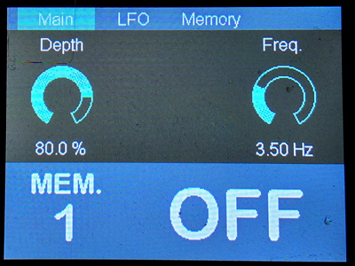
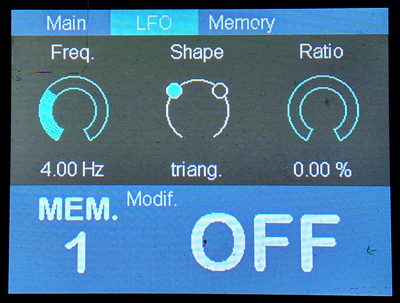
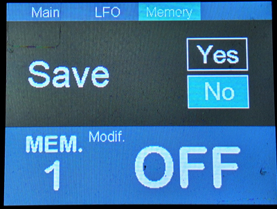

# PENDAII-Software
PENDAII-Software is the new version of the software framework specifically designed to take full advantage of the PENDAII stereo hardware.

## Introduction
PENDAII Software is a collection of audio effects built on an advanced framework, specifically designed for the PENDAII Hardware platform ([GitHub Link](https://github.com/DADDesign-Projects/PENDAII-Hardware)). You can use this framework to easily develop your own high-quality audio effect pedals, focusing entirely on signal processing while the framework handles all hardware complexities. 

### Author
This project is developed by DAD Design.

### License
PENDAII Software is released under the **MIT License**.

### Feedback
I would be very happy to receive your feedback on the use of this project. If you've worked on any projects using PENDA Software or have suggestions, bug reports, or any questions, don't hesitate to contact me!

## Key Features
### Audio Effects

#### Delay

- Main delay adjustable from 0.100 to 1.5 seconds.
- Second delay line available with selectable rhythmic subdivisions.
- Modulation applied to the delayed signal for subtle chorus/flanger-type effects.
- Independent bass and treble control on echoes to fine-tune their tonal character.
	
#### PENDA Software Framework

- Full Integration: Seamlessly works with PENDAII Hardware and DAISY Seed.
- Optimized Audio Processing: Built-in support for the Audio CODEC, handling initialization and real-time processing.
- Memory Management:
    - SDRAM for large, volatile data storage.
    - QSPI Flash for fast, non-volatile storage, including file persistence and flashing utilities.

- Graphical User Interface (GUI):
    - TFT Display with ST7789 driver support.
    - DaisySeedGFX2 for advanced visualization and PendaUI for customizable user interface management.
    - Interactive controls via footswitches (tap tempo), rotary encoders, and MIDI protocol.

- Development Environment:
    - Built with STM32Cube, offering a modular and extensible architecture for easy customization.

With PENDAII Hardware, this framework provides an all-in-one solution for pedal effect development, eliminating the need for low-level hardware management.

## Resources
- **PENDAII-Hardware Repository**: [GitHub Link](https://github.com/DADDesign-Projects/PENDAII-Hardware)
- **DaisySeedGFX2 Repository**: [GitHub Link](https://github.com/DADDesign-Projects/DaisySeedGFX2)
- **Daisy_QSPI_Flasher Repository**: [GitHub Link](https://github.com/DADDesign-Projects/Daisy_QSPI_Flasher)

## Generic GUI
### Encoder Controls

- **Encoder 0 (Right):**  
  Scroll through the menu

- **Encoders 1/2/3 (Above display):**  
  Adjust the displayed parameter below  
  *(Pro tip: Press + turn simultaneously for precision adjustment)*

### Memory Screen Functions
- **Encoder 1 (Top left):** Select function → `Save` / `Restore` / `Erase`
- **Encoder 2 (Top center):** Select target memory slot
- **Encoder 3 (Top right):**  
  - Switch to `Yes` to confirm  
  - Press to execute action

> **Important Notes:**  
> - Cannot erase currently active memory  
> - Cannot restore/erase never-saved slots

### Footswitch Controls

#### Footswitch 1
- **Short press:** Cycle memory presets  
- **Long press (1.5s):** Toggle effect On/Off

#### Footswitch 2
- **Tap tempo:** Controls tremolo rate

### GUI Screenshot

